# RADIAN

<p align="center">
  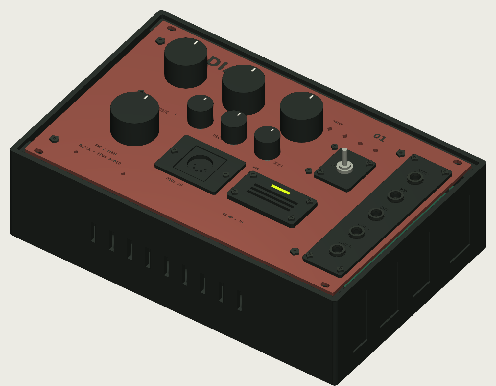
</p>

<p align="center">
  <a href="#listen"><b>Listen</b></a> ·
  <a href="#see-the-mesh-move"><b>See the mesh move</b></a> ·
  <a href="#the-hardware"><b>Hardware & 3D</b></a> ·
  <a href="#1-mathematical-foundation"><b>The maths</b></a> ·
  <a href="#4-architecture"><b>Architecture</b></a>
</p>

A 2D finite-difference physical-modeling synthesis engine in structural VHDL,
with an amplitude-dependent non-linear "chaos injection" term, playable
polyphonically over MIDI or CV.

Instead of recording or sampling an instrument, RADIAN solves the 2D acoustic
wave equation in real time on an FPGA mesh of arithmetic cells and streams the
result out as stereo audio: a vibrating drum head, a plate, a sheet of metal,
*computed* rather than recorded. A non-linear tension term makes the mesh
stiffen under load, so hard hits bend pitch upward and bloom into inharmonic,
metallic partials before settling into a natural decay. Notes arrive over MIDI
or control voltage, are allocated across independent polyphonic voices, and are
shaped by recallable instrument presets and a live front panel.

<sub>RADIAN was developed as **Courant**, which is why the repository and
some file paths still use that name.</sub>

> **Status: simulation-first, feature-complete in simulation, pre-hardware.**
> The engine, a Q1.23 reference model that is *bit-exact* to the RTL, and a full
> playable top (MIDI/CV $\rightarrow$ polyphony $\rightarrow$ I2S audio) are
> developed and verified under the current RTL regression across 31 testbenches. Board bring-up on a
> Digilent Arty A7 + Pmod I2S2 is the next step; nothing is claimed to work on
> hardware until it does.

---

## Listen

These clips come **out of the RTL**. A cycle-accurate Verilator build of
`synth_top` (4 voices, 8 $\times$ 8 mesh, 4$\times$ oversampling,
time-multiplexed) receives the score as bit-level serial MIDI at 31250 baud.
The note mapping, voice allocation, polyphonic meshes, mixer, DC blocker,
clock-domain crossing and I2S serialiser all run in it, and its 24-bit I2S
output is captured. Each clip gets one constant gain to peak at −1 dBFS. There
is no EQ, compression, reverb or editing. **They are not hardware
recordings**: the FPGA has not been brought up yet. Click a spectrogram or a ▶
link and the clip plays in your browser.

| Clip | What you hear | Listen |
| --- | --- | --- |
| **Gong Chorale** | A-minor chord progression on the gong preset. 3–4 voices ring into each other | [▶ `rtl_gong_chorale.mp3`](https://cdn.jsdelivr.net/gh/KrasForge/Courant@a1daff8e3a3599e712c28fc31fcfe1d983a12df5/docs/media/audio/rtl_gong_chorale.mp3) · 13 s |
| **Chaos Swell** | One held gong chord while CHAOS is turned up live over the control bus and back down | [▶ `rtl_chaos_swell.mp3`](https://cdn.jsdelivr.net/gh/KrasForge/Courant@a1daff8e3a3599e712c28fc31fcfe1d983a12df5/docs/media/audio/rtl_chaos_swell.mp3) · 12 s |
| **Plate Arpeggio** | Rolling pentatonic arpeggios on the plate preset with overlapping held notes, 112 BPM | [▶ `rtl_plate_arpeggio.mp3`](https://cdn.jsdelivr.net/gh/KrasForge/Courant@a1daff8e3a3599e712c28fc31fcfe1d983a12df5/docs/media/audio/rtl_plate_arpeggio.mp3) · 11 s |
| **Mallet Groove** | Marimba-like line on the damped drum preset over a held bass, 120 BPM | [▶ `rtl_mallet_groove.mp3`](https://cdn.jsdelivr.net/gh/KrasForge/Courant@a1daff8e3a3599e712c28fc31fcfe1d983a12df5/docs/media/audio/rtl_mallet_groove.mp3) · 10 s |
| **Berlin Voltage** | Dry EBM / industrial pulse, 132 BPM | [▶ `rtl_berlin_voltage.mp3`](https://cdn.jsdelivr.net/gh/KrasForge/Courant@f79031551d7316b354aa7c6243a771c9426d3952/docs/media/audio/rtl_berlin_voltage.mp3) · 10 s |
| **Oxide Dub** | Free-boundary metallic dub with long tails, 96 BPM | [▶ `rtl_oxide_dub.mp3`](https://cdn.jsdelivr.net/gh/KrasForge/Courant@f79031551d7316b354aa7c6243a771c9426d3952/docs/media/audio/rtl_oxide_dub.mp3) · 10 s |
| **Kreuz Rhythm** | Metallic polyrhythm with a tense finish, 150 BPM | [▶ `rtl_kreuz_rhythm.mp3`](https://cdn.jsdelivr.net/gh/KrasForge/Courant@f79031551d7316b354aa7c6243a771c9426d3952/docs/media/audio/rtl_kreuz_rhythm.mp3) · 10 s |

[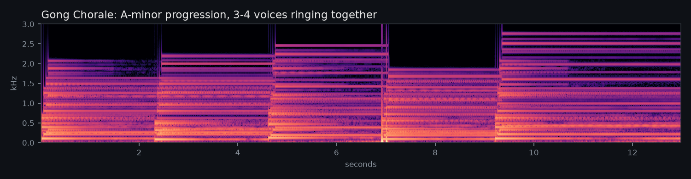](https://cdn.jsdelivr.net/gh/KrasForge/Courant@a1daff8e3a3599e712c28fc31fcfe1d983a12df5/docs/media/audio/rtl_gong_chorale.mp3)
[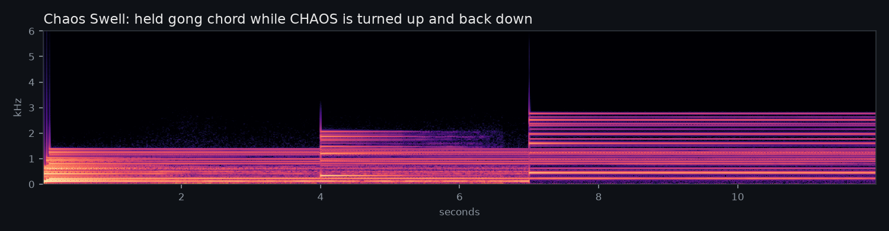](https://cdn.jsdelivr.net/gh/KrasForge/Courant@a1daff8e3a3599e712c28fc31fcfe1d983a12df5/docs/media/audio/rtl_chaos_swell.mp3)
[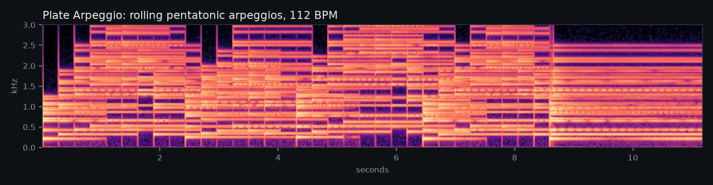](https://cdn.jsdelivr.net/gh/KrasForge/Courant@a1daff8e3a3599e712c28fc31fcfe1d983a12df5/docs/media/audio/rtl_plate_arpeggio.mp3)
[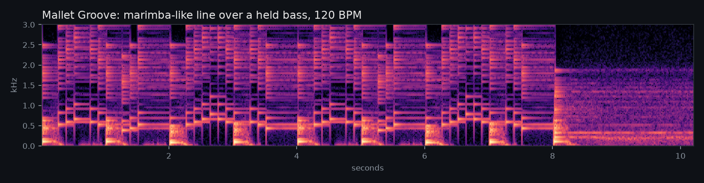](https://cdn.jsdelivr.net/gh/KrasForge/Courant@a1daff8e3a3599e712c28fc31fcfe1d983a12df5/docs/media/audio/rtl_mallet_groove.mp3)

<sub>Rendered from the repaired RTL of 2026-09-16, the build behind
[`docs/sound_engine_repair.md`](docs/sound_engine_repair.md). It predates the
FX chain (drive, delay, chorus, reverb), the physical mallet and plate
stiffness, so these clips are the dry resonator. The scores are in
[`docs/media/scores/`](docs/media/scores/), and
[`make_scores.py`](docs/media/scripts/rtl/make_scores.py) writes the first
four. Rebuild the renderer from the
current RTL with
[`docs/media/scripts/rtl/build_renderer.sh`](docs/media/scripts/rtl/build_renderer.sh);
the whole 100 MHz system clock is simulated, so expect several minutes of CPU
per second of audio. Each clip also has an `.mp4` (spectrogram with a moving
playhead) in [`docs/media/audio/`](docs/media/audio/).</sub>

### Chaos off vs. chaos on

This one illustrates the non-linearity in the float reference model
([`model/NLMesh2D.m`](model/NLMesh2D.m), the same update as the RTL) on a
32 $\times$ 32 mesh. The same centre strike on the same gong mesh, first linear
($\alpha = 0$), then with chaos injection ($\alpha = 0.42$). The linear mesh
rings as a clean stack of fixed modes. With the amplitude-dependent term,
energy smears across the band right after the hit and the partials bend as the
mesh relaxes.

[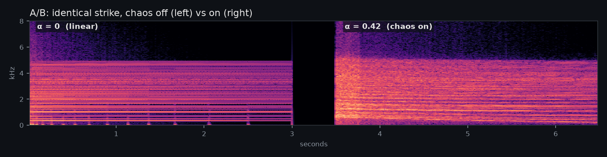](https://cdn.jsdelivr.net/gh/KrasForge/Courant@main/docs/media/audio/chaos_ab.mp3)

The flat ceiling near 5 kHz is not a filter. It is the highest mode a 2D
mesh can carry, $f_{\max} = \tfrac{f_s}{\pi}\arcsin(\gamma\sqrt{2}) \approx 4.9$ kHz
for this gong's $\gamma^2 = 0.05$. A finer mesh for the same pitch raises
$\gamma$ and lifts it.

### See the mesh move

The same hard strike on both meshes, slowed down about 800 $\times$. On the
left the wavefront spreads at one speed. On the right the loud centre
stiffens, so it runs ahead and breaks into fine, high-frequency ripples:
those ripples are the inharmonic partials you hear.

<p align="center">
  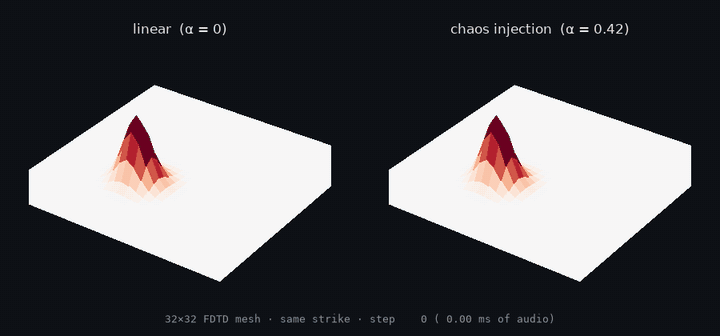
</p>

---

## The hardware

The engine targets a two-board desktop/Eurorack instrument. A 160 $\times$ 100 mm,
six-layer **Artix-7 mainboard** (FPGA, flash, clocks, PCM5102A DAC, CV/pot ADC,
opto-isolated MIDI) carries a **panel/interface board** 19.99 mm above it on
two 20-pin Samtec mezzanines. The panel has six knobs (TENSION · DECAY ·
CHAOS large, DRIVE · DELAY · REVERB small), a push encoder, the MODE switch,
four LEDs and five patch jacks. Neither board has been fabricated yet. See
[`hardware/CURRENT_DESIGN.md`](hardware/CURRENT_DESIGN.md) for what is and is
not validated.

<p align="center">
  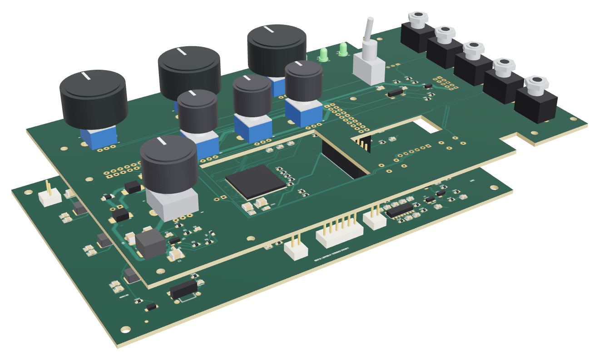<br>
  <sub>The two boards out of the case: the panel/interface board mated 19.99 mm above the Artix-7 mainboard.</sub>
</p>

<p align="center">
  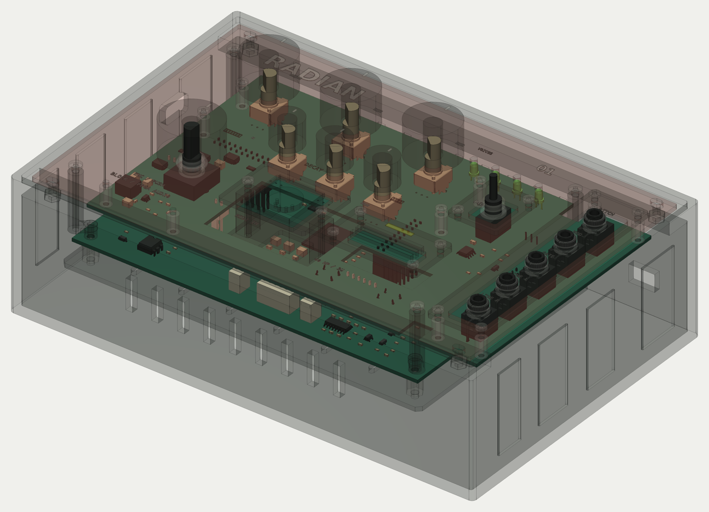<br>
  <sub>See-through view of the desktop case with both boards and the actual-part 3D models inside, rendered from
  the STEP assembly described in <a href="hardware/CURRENT_DESIGN.md"><code>hardware/CURRENT_DESIGN.md</code></a>
  (the STEP files themselves are not committed). The case has not been built yet.</sub>
</p>

| Mainboard (top) | Panel / interface board (front) |
| --- | --- |
| 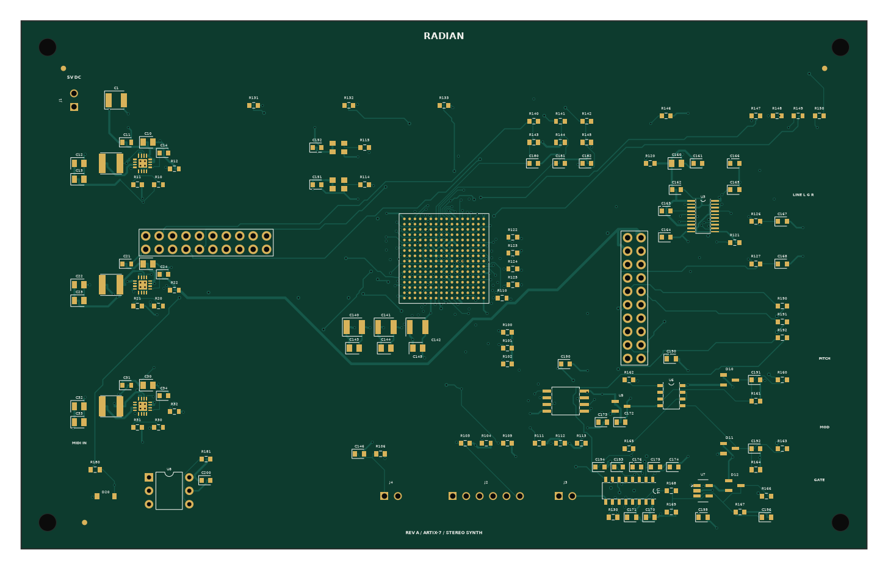 | 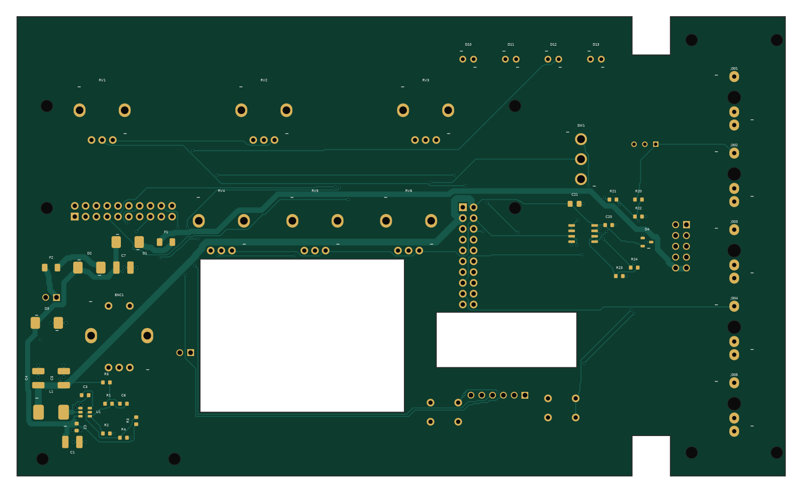 |
| 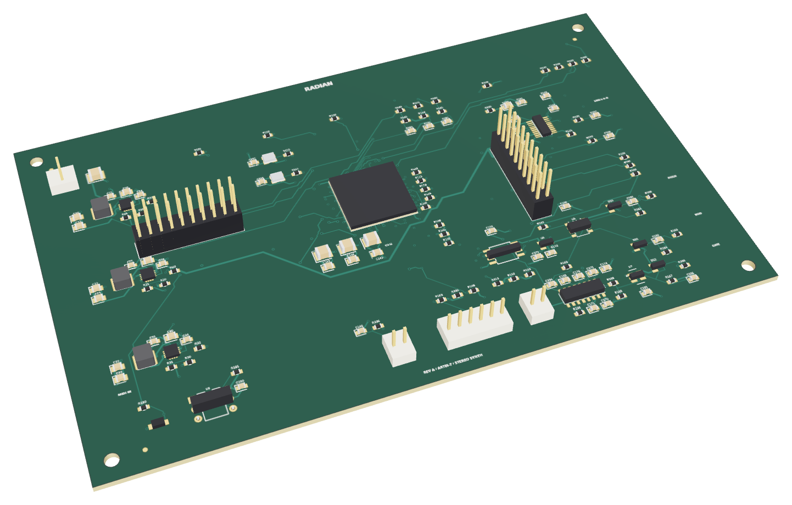 | 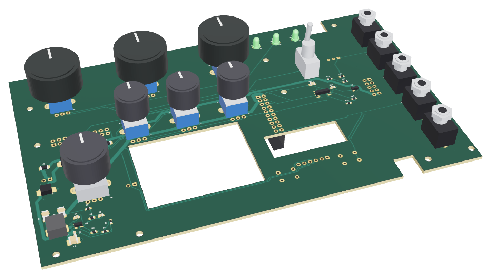 |

<p align="center">
  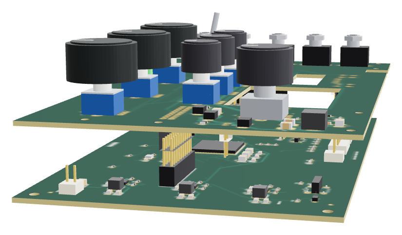<br>
  <sub>Side view of the stack. The mainboard's Samtec IPT1 posts reach into the panel's IPS1 sockets; the FPGA shows through the panel window.</sub>
</p>

**Open the 3D model:** [`courant_stack.stl`](docs/media/3d/courant_stack.stl)
opens in GitHub's built-in 3D viewer, so you can orbit it in the browser. The
coloured glTF files ([stack](docs/media/3d/courant_stack.glb),
[mainboard](docs/media/3d/courant_mainboard.glb),
[panel](docs/media/3d/courant_panel.glb)) open in any glTF viewer, Blender, or
https://gltf-viewer.donmccurdy.com.

<sub>Every outline, drill, pad, track and component position is read straight
from the native KiCad 10 boards. Component bodies are simplified parametric
stand-ins sized from package datasheets, and the knobs are illustrative. The
full actual-part STEP assembly lives outside the repo, so treat these as
layout previews, not mechanical CAD. Regenerate everything with
[`docs/media/scripts/make_media.sh`](docs/media/scripts/make_media.sh).</sub>

---

## Why an FPGA

A 2D mesh is embarrassingly parallel: every node runs the *same* small update
every time step, reading only its four neighbours. That maps naturally onto FPGA
fabric, where many nodes update concurrently and the per-sample cost does not
grow the way a sequential `for`-loop over the grid does on a CPU.

The honest trade is real, and this README states it plainly rather than selling
a fantasy:

| Aspect | Software (CPU / plugin) | This FPGA engine |
| --- | --- | --- |
| **Grid scaling** | Sequential per node; cost grows with node count | Concurrent nodes; one mesh step per audio sample, independent of node count (up to the fabric's DSP/LUT budget) |
| **Latency** | Governed by the host audio buffer (roughly 0.7 to 6 ms typical) | Deterministic, sub-sample; no block buffering. Group delay through the model is the physical wave propagation itself |
| **Per-node non-linearity** | Often simplified or dropped to save CPU | Evaluated on every node, every step |
| **Iteration speed** | Edit, recompile in seconds | Requires re-synthesis (minutes); behaviour bounded by chosen fabric |
| **Cost / footprint** | Runs on hardware you already own | Needs an FPGA plus an audio codec; each extra voice consumes finite DSP/LUT |

FPGAs win on **deterministic parallelism and latency**. Software wins on
**flexibility and cost**. This project is about the former.

---

## 1. Mathematical foundation

The engine models a lossy 2D wave equation for the transverse displacement
$u(x, y, t)$ of the surface:

$$\frac{\partial^2 u}{\partial t^2} = c^2\left(\frac{\partial^2 u}{\partial x^2} + \frac{\partial^2 u}{\partial y^2}\right) - 2\sigma\frac{\partial u}{\partial t}$$

- $c$ is the wave propagation speed (sets pitch and tension);
- $\sigma$ is the frequency-independent damping (sets decay time).

### Discretisation

Using centred finite differences on a grid with spacing $h$ and time step
$k = 1/f_s$ (with $f_s$ the audio rate, e.g. 48 kHz), the explicit update for
node $(i, j)$ is:

$$u_{i,j}^{n+1} = \frac{1}{1+\sigma k}\left[\,2u_{i,j}^{n} - (1-\sigma k)\,u_{i,j}^{n-1} + \gamma^2\left(u_{i+1,j}^{n} + u_{i-1,j}^{n} + u_{i,j+1}^{n} + u_{i,j-1}^{n} - 4u_{i,j}^{n}\right)\right]$$

where $\gamma = ck/h$ is the **Courant number**. The bracketed Laplacian stencil
is the only inter-node coupling; everything else is local. In the RTL the two
damping coefficients are precomputed on the control bus,

$$a_0 = \frac{1}{1+\sigma k}, \qquad \mathrm{sigk1} = 1 - \sigma k,$$

so no node ever performs a division (division is expensive in fabric; this
avoids it entirely).

### Stability (CFL), and why it is the whole game here

An explicit 2D scheme is only stable when the Courant number satisfies

$$\gamma^2 \le \tfrac{1}{2}\qquad\left(\gamma \le \tfrac{1}{\sqrt 2}\approx 0.7071\right).$$

Cross that line and the scheme does not merely "sound bad," it diverges
**exponentially**. This constraint governs every design decision in the next
section.

---

## 2. The non-linear twist: chaos injection

A linear mesh with a constant $\gamma$ is predictable and, frankly, a bit
sterile. RADIAN makes the local Courant term **amplitude-dependent**, so the
mesh stiffens where it is moving hardest:

$$\gamma_{i,j}^2 = \gamma_0^2 + \alpha\,(u_{i,j}^{n})^2$$

- $\gamma_0^2$ is the base stiffness and pitch;
- $\alpha$ is the chaos coupling.

High-amplitude regions momentarily raise the local wave speed, bending the
wavefront, shifting pitch up, and bleeding energy into inharmonic partials. This
is the characteristic "tension modulation" of struck plates and gongs, including
genuine period-doubling routes into chaos.

### The catch (and the fix)

The term $\alpha u^2$ only ever *increases* $\gamma^2$, and it does so hardest
exactly when the sound is loudest, pushing toward the CFL boundary precisely when
you least want it to. Naively, a hard hit drives $\gamma^2 > 1/2$ and the mesh
blows up. **Output saturation alone does not save you**: it clamps the
*displayed* sample while the internal state pins to the rails and buzzes at
Nyquist. You get a brick, not a gong.

The fix is structural, and is treated here as a first-class part of the design
rather than an afterthought:

1. **Clamp the local term:**
   $\gamma^2_{i,j} = \mathrm{clamp}(\gamma_0^2 + \alpha u^2,\ 0,\ \gamma^2_{\max})$
   with $\gamma^2_{\max} < 1/2$ (a safety margin below the CFL limit). This
   bounds the instability into a limit-cycle / soft-clip regime that is chaotic
   and rich, but convergent.
2. **Saturating state arithmetic:** displacement is clamped to the Q1.23 range,
   turning blow-up energy into musical soft saturation instead of wrap-around.
3. **Guaranteed decay:** the damping term $\sigma$ ensures the linear regime
   always returns to rest.

### Aliasing, stated rather than hidden

A squaring non-linearity at the base sample rate generates harmonics above
Nyquist that fold back as aliasing. "Zero aliasing" would be a false claim for
any non-linear scheme. The mitigation is **oversampling**: run the mesh at an
integer multiple of $f_s$ (the FPGA has ample clock headroom) and decimate on
output. The oversampling factor `OS` is a documented quality / area knob, not
magic; see [`docs/oversampling.md`](docs/oversampling.md).

---

## 3. Numerics

| Property | Value |
| --- | --- |
| Format | Signed **Q1.23** (24-bit two's complement) |
| Range / resolution | $[-1.0, +1.0)$ / $2^{-23}\approx 1.19\times 10^{-7}$ |
| Multiply | Q1.23 $\times$ Q1.23 gives Q2.46, rescaled by a `>>23` shift with round-to-nearest, saturated |
| Accumulation | Wide 48-bit guard accumulator, saturated on store |
| Coefficients | $a_0$ and $\mathrm{sigk1}$ precomputed on the control bus, so there is no per-node division |
| Overflow | Saturating arithmetic throughout: graceful soft-clip, never wrap-around spikes |

All fixed-point helpers (`sat_q123`, the rounding multiply, the clamp) live in
[`src/rtl/fdtd_pkg.vhd`](src/rtl/fdtd_pkg.vhd) and are exercised bit-for-bit
against the reference model (section 6).

---

## 4. Architecture

```
 MIDI / CV --> note mapping --.                     .--> I2S TX --> codec (DAC)
                              v                     |
   preset bank --> coeffs --> poly voices (N meshes + mix) --> CDC --> (audio clk)
                              ^                     |
        panel knobs/encoder --'   sample strobe <--'  (I2S word clock -> frame)
```

### Node Processing Element (PE)

Each node ([`node_element.vhd`](src/rtl/node_element.vhd)) owns:

- **State registers** holding $u^n$ and $u^{n-1}$;
- **A pipelined Q1.23 datapath** for the update above (Laplacian, the
  $\alpha u^2$ term, the $\gamma^2_{\max}$ clamp, the bracket, and the $a_0$
  scale), mapped to DSP slices;
- **Nearest-neighbour wiring** (N/S/E/W). Edge nodes use **fixed** ($u = 0$,
  Dirichlet) or **free** (mirrored, Neumann) boundaries.

### Spatial vs. time-multiplexed: the real engineering choice

A *fully spatial* mesh instantiates one PE per node. That is $O(N^2)$ DSP slices
and hits a hard ceiling fast: a 32$\times$32 mesh with a couple of multipliers
per node is well over a thousand DSPs, beyond most mid-range parts. The two
honest options, selected at synthesis time via the `mesh` wrapper and the
`TIME_MUX` generic:

- **Fully spatial** ([`grid_mesh.vhd`](src/rtl/grid_mesh.vhd)): small mesh on a
  large FPGA. Lowest latency, biggest area.
- **Time-multiplexed** ([`grid_mesh_tdm.vhd`](src/rtl/grid_mesh_tdm.vhd)): fold
  the grid through a single shared PE. At 100 MHz over 48 kHz there are roughly
  2083 system-clock cycles per audio sample, plenty to sweep a modest grid
  through one pipeline and still finish within a sample period. This costs
  ~18 DSP per voice *independent of grid size*, and it is the only way
  polyphony fits a small device.

Same RTL, a synthesis-time trade, documented per target in
[`docs/resource_budget.md`](docs/resource_budget.md).

### "Single cycle" and "zero latency": what is actually true

The per-node update is a multi-stage pipeline (multiplies, the clamp, the final
scale), not a single combinational clock edge. What *is* true:

- **One mesh time-step per audio sample:** the mesh advances on each sample
  strobe;
- **No audio-buffer latency:** there is no DAW block to fill, so end-to-end
  latency is sub-sample and deterministic, dominated by the codec and the PE
  pipeline depth (nanoseconds to microseconds), not milliseconds.

### Clocking and clock-domain crossings

The design spans two clock domains:

| Domain | Clock | Contents |
| --- | --- | --- |
| System | `sys_clk` (e.g. 100 MHz) | MIDI/CV front-ends, preset bank, polyphony (the mesh) |
| Audio | I2S `bclk` (divided from `mclk`) | I2S transceiver |

[`i2s_clkgen.vhd`](src/rtl/i2s_clkgen.vhd) makes the FPGA the **I2S master**:
from an audio master clock `mclk` (e.g. 12.288 MHz from an MMCM) it generates
MCLK / BCLK / LRCLK for the codec. [`sample_strobe.vhd`](src/rtl/sample_strobe.vhd)
crosses LRCLK back into `sys_clk` as the per-frame pulse that advances the mesh
one step per audio sample. Only two data crossings exist, both verified
primitives: a two-flop synchroniser on the async serial MIDI input, and the
stereo pickup word crossing `sys_clk` $\rightarrow$ `bclk` through
[`cdc_word.vhd`](src/rtl/cdc_word.vhd) (an MCP handshake). See
[`docs/cdc.md`](docs/cdc.md).

---

## 5. Playability

The engine is wrapped into a complete, flashable instrument
([`synth_top.vhd`](src/rtl/synth_top.vhd), board wrapper
[`syn/vivado/arty_synth.vhd`](syn/vivado/arty_synth.vhd)).

- **MIDI** ([`midi_frontend.vhd`](src/rtl/midi_frontend.vhd) over
  [`midi_uart_rx.vhd`](src/rtl/midi_uart_rx.vhd)): parses the 31250-baud serial
  stream, maps note number through a discrete-mesh calibrated pitch table, and
  maps velocity to strike amplitude only. CHAOS is an independent panel/CV
  control. See [`docs/midi.md`](docs/midi.md).
- **Control voltage** ([`cv_frontend.vhd`](src/rtl/cv_frontend.vhd)): the same note-mapping interface, driven from 1V/oct pitch, a gate, and a mod CV. MIDI/CV arbitration is normally automatic: the newest MIDI note-on or CV gate edge claims the source. Presets/registers can force MIDI or CV, while the legacy `cv_sel` port remains only as a force-CV/debug override. See [`docs/cv.md`](docs/cv.md).
- **Polyphony** ([`poly_voices.vhd`](src/rtl/poly_voices.vhd) +
  [`voice_allocator.vhd`](src/rtl/voice_allocator.vhd)): allocates each note to
  a free voice, runs `NVOICES` independent meshes, and averages their stereo
  pickups. With `TIME_MUX` the voices fold onto shared PEs so polyphony fits a
  small part. See [`docs/polyphony.md`](docs/polyphony.md).
- **Presets** ([`preset_bank.vhd`](src/rtl/preset_bank.vhd)): supplies TENSION, DECAY, CHAOS, the CFL clamp, **STIFFNESS / plate dispersion**, **HARDNESS / stateful physical mallet**, pickup geometry, RIM compliance, STRIKE SIZE/X/Y, MATERIAL/ANISO/CHARACTER and source override. Voice-relevant settings are latched into each newly struck voice. See [`docs/presets.md`](docs/presets.md).
- **Front panel** ([`panel_ctrl.vhd`](src/rtl/panel_ctrl.vhd)): the existing MODE switch is PLAY/EDIT. PLAY keeps TENSION/DECAY/CHAOS/DRIVE/DELAY/REVERB and encoder preset navigation; EDIT reuses the encoder to select soft-takeover parameter pages, with SURFACE currently mapping ANISO/RIM/STRIKE SIZE/STRIKE X/STRIKE Y/CHARACTER. The four LEDs show voices in PLAY and the selected page in EDIT. No new pot, ADC channel, connector or PCB signal is required. See [`docs/panel.md`](docs/panel.md).

The end-to-end path (MIDI/CV $\rightarrow$ note mapping $\rightarrow$ preset
merge $\rightarrow$ polyphonic meshes $\rightarrow$ CDC $\rightarrow$ I2S) is
described in [`docs/synth_top.md`](docs/synth_top.md).
The 2026-09-16 musical calibration/quality repair and acceptance results are in [`docs/sound_engine_repair.md`](docs/sound_engine_repair.md).

---

## 6. The reference model (bit-exact)

[`model/`](model/) holds a MATLAB/Octave reference implementation used both to
explore the physics and to *lock the RTL numerically*. The linear
([`Mesh2D.m`](model/Mesh2D.m)), stiff ([`StiffMesh2D.m`](model/StiffMesh2D.m)),
spatially-varying ([`VarMesh2D.m`](model/VarMesh2D.m)) and non-linear
([`NLMesh2D.m`](model/NLMesh2D.m)) meshes each have a study script (stability,
chaos, exciters, oversampling, materials). Crucially,
[`nl_reference.m`](model/nl_reference.m) regenerates the legacy nonlinear Q1.23 golden trace, while [`stiffness_reference.py`](model/stiffness_reference.py) and [`mallet_reference.py`](model/mallet_reference.py) independently regenerate the production fixed-point STIFFNESS and physical-mallet/HARDNESS traces. Their testbenches replay those traces step for step, so the corresponding hardware paths are verified **bit-exact** to independent models rather than merely "close." [`demo_render.m`](model/demo_render.m) renders musical, nonlinear, polyphonic demo audio.

---

## 7. Repository structure

```text
src/
  rtl/     Q1.23 package + node PE, spatial & time-mux meshes and selector,
           I2S transceiver + master clock gen + sample strobe, cdc_word,
           MIDI + CV front-ends, voice allocator + polyphony, preset bank,
           panel controller, control bus, synth_top (the playable design)
  tb/      31 RTL testbenches: unit (node, fdtd_pkg, i2s, cdc, uart, mallet) ->
           bit-exact golden traces (nl_mesh, mesh_impulse, boundary, pickup) ->
           end-to-end audio (synth_top, poly, preset_top, latency)
model/     MATLAB/Octave reference model (bit-exact to the RTL) + physics
           studies (stability, chaos, stiffness, spatial, exciters) + demos
sim/       GHDL Makefile: `make -C sim` analyses and runs the whole suite
syn/       yosys (open-source resource estimate) and Vivado (sign-off) flows,
           the Arty A7 + Pmod I2S2 constraints, and the board wrapper arty_synth
docs/      derivations, fixed-point + CFL analysis, per-feature notes
           (midi, cv, polyphony, presets, panel, cdc, oversampling, timing),
           the resource budget, and a deviations log
  media/   README sound demos, spectrograms, board renders, 3D models (.glb/.stl)
           and the scripts that regenerate them from model/ and hardware/
hardware/  native KiCad 10 mainboard (courant/) and panel/interface board
           (panel/), the shared direct-stack contract (stack/)
```

---

## 8. Building & simulating

The reference flow uses **GHDL** (open-source, VHDL-2008):

```sh
make -C sim                      # analyse + elaborate + run all 31 testbenches
octave-cli --eval "demo_render"  # render nonlinear polyphonic demo audio (model/)
docs/media/scripts/rtl/build_renderer.sh build  # cycle-accurate RTL audio renderer (Verilator)
docs/media/scripts/make_media.sh # regenerate README audio, spectrograms, PCB renders, 3D models
cd syn/yosys && ./report_util.sh # DSP / LUT / FF resource estimate (yosys)
```

A single unit test can be run directly, e.g.

```sh
ghdl -a --std=08 src/rtl/fdtd_pkg.vhd src/rtl/node_element.vhd src/tb/node_element_tb.vhd
ghdl -r --std=08 node_element_tb --wave=sim/node.ghw
```

---

## 9. Target hardware and resources

Synthesis targets a low-cost dev board for bring-up: a **Digilent Arty A7**
(Xilinx Artix-7) with a **Pmod I2S2** codec, keeping the path to real audio
cheap and reproducible. The FPGA is the I2S master; the constraints live in
[`syn/vivado/arty_synth.xdc`](syn/vivado/arty_synth.xdc). The Vivado non-project
flow ([`build_synth.tcl`](syn/vivado/build_synth.tcl)) runs opt/place/route and
fails the build on negative slack (a pass/fail timing gate).

Beyond the dev board there is a **standalone instrument PCB** — a 160 x 100 mm
six-layer board carrying an XC7A50T, its configuration flash, both oscillators,
a PCM5102A stereo DAC, and the analog front end the Arty build leaves off (panel
pots and CV over an MCP3208, an opto-isolated MIDI input, a gate comparator).
It started in [tscircuit](https://tscircuit.com) and is now maintained as native
KiCad 10 boards in [`hardware/courant/`](hardware/courant/) (mainboard) and
[`hardware/panel/`](hardware/panel/) (panel/interface board); every device
pinout is checked against its manufacturer datasheet and the FPGA ball map
against AMD's own package file. Both boards are **fully routed but never
fabricated**: the mainboard has 2158 track segments, 4386 mm of copper and 299
vias, and KiCad DRC reports 0 violations / 0 unconnected on both boards. See
[`hardware/CURRENT_DESIGN.md`](hardware/CURRENT_DESIGN.md) and
[`docs/board.md`](docs/board.md) for what is and is not verified.

Using the time-multiplexed mesh (~18 DSP per voice, independent of grid size),
resources scale roughly linearly with voice count:

| Voices | DSP48 | LUT | Fits |
| --- | --- | --- | --- |
| 1 | ~24 | ~8.6k | A7-35T |
| 2 | ~38 | ~15.6k | A7-35T |
| 4 | ~74 | ~30.4k | A7-35T (90 DSP) |
| 8 | ~146 | ~61.6k | A7-100T (240 DSP) |

Numbers are from the open-source yosys flow; the yosys LUT figures are
pessimistic (a combinational-read mesh memory maps to LUT mux-trees, where
Vivado would infer LUTRAM/BRAM). Full table and caveats in
[`docs/resource_budget.md`](docs/resource_budget.md).

---

## 10. What this is and is not

- It **is** a deterministic, low-latency, parallel physical-modeling engine and
  an honest study of non-linear FDTD on FPGA, playable over MIDI and CV.
- It **is** simulation-first: nothing is claimed to "work on hardware" until it
  has. The RTL, the reference model, and the full playable top are complete and
  verified in simulation.
- It is **not** zero-latency, zero-aliasing, or single-clock-cycle. Those are
  marketing, and this document avoids them deliberately.
- It is **not** yet a hardware product. The standalone boards are routed and
  pass DRC, and the MCP3208 SPI reader for the panel / CV ADC
  ([`adc_mcp3208.vhd`](src/rtl/adc_mcp3208.vhd)) passes its testbench, but
  nothing has been fabricated or brought up yet.

---

## License

MIT.
